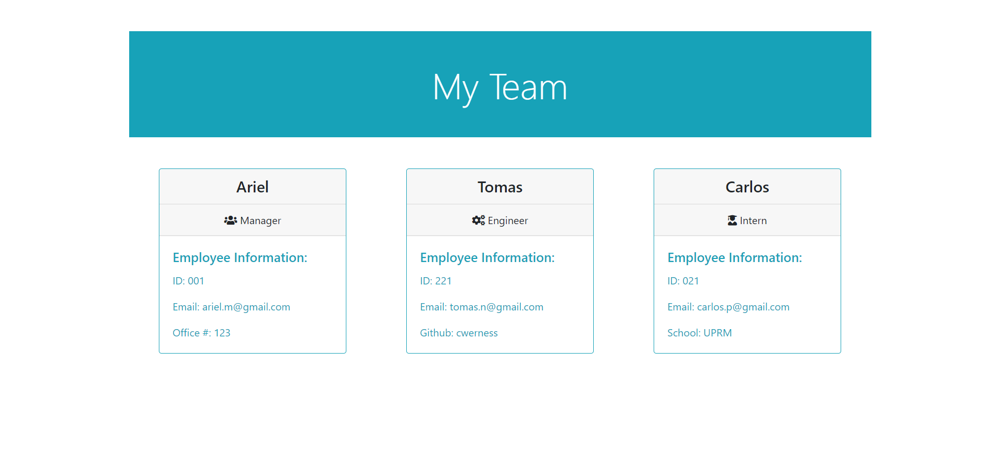

# [Best Team Profile Generator](https://github.com/arielo5/Best_Team_Profile_Generator) 

[](https://choosealicense.com/licenses/mit/)

  ## Table of Contents

  - [Description](#description)
  - [Installation](#installation)
  - [Usage](#usage)
  - [License](#license)
  - [Contributing](#contributing)
  - [Tests](#tests)

  ## Description
  
  The motivation for this project was to build a Node.js command-line application that takes in information about employees on a software engineering team, then generates an HTML webpage that displays summaries for each person. The reason for this is to help create a html file that will display every member of the team with some informaiton on how to contact them. It solve a better and faster way to to get their basic information. For this project I learn that to better improve myself I need to continuously learn all the new tips and knowledge that I can  implement in every project that I can get my hands on.

  ## Installation

  Steps to install application:
  1. Clone repository.
  2. In the directory with server.js run npm install
  3. In the command line run node index.js
  4. Start answering the prompts questions
  5. HTML Generated

```
npm install
```
  ## Usage
  
  After you run 'node index.js' it will promt some questions about your team and every detail it will need to fill in the html file. Some example of the questions that it will give are the name of the Manager, the number id, your github profile and other question depending of the Employee.

  ### Screenshots

1. Working app

[Video of the working App](https://drive.google.com/file/d/1T5IxkaFcdL7iGG4tNkbfGgfRTfCbLIzW/view?usp=sharing)

2. Example of a team profile generated



### Snippets


1. nextEmployee();

```javascript

nextEmployee() {
    this.promptRole().then((role) => {
        if (role === "Exit") {
            this.renderHTML();
            this.end();
            }
        else {
            this.promptInfo(role).then((data) => {
                switch (role) {
                    case "Manager":
                        var employee = new Manager(data.name data.id, data.email, data.officeN);
                        break;
                    case "Engineer":
                        var employee = new Engineer(data.name, data.id, data.email, data.github);
                        break;
                    case "Intern":
                        var employee = new Intern(data.name, data.id, data.email, data.school);
                        break;
                }
                this.employees.push(employee);
                this.nextEmployee();
            });
        }
    });
}
    
```
* This function uses recursion to keep gathering employee information from the user until the user quits the program. It calls on a function that will prompt the user to select to either add an employee or to exit the application. If the user decides to exit, the application will call to generate the team profile HTML and end the appliciaton. Otherwise, it will ask user for further information on the employee and create a new _Employee_ object based on that information. Next, it will call itself to prompt the user again whether to add another employee or exit the application.


2. promptInfo(role)

```javascript

    //prompt user for employee information and return it
    promptInfo(role) {
        switch (role) {
            case "Manager":
                return inquirer.prompt(this.managerPrompt).then(function (data) {
                    return data;
                });
                break;
            case "Engineer":
                return inquirer.prompt(this.engineerPrompt).then(function (data) {
                    return data;
                });
                break;
            case "Intern":
                return inquirer.prompt(this.internPrompt).then(function (data) {
                    return data;
                });
                break;
        }
    }

```
* This function will return a function that will prompt the user to input information according to the type of employee they've chosen. This function comes with a promise that returns the data collected by _inquirer.prompt()_
  
  ## Contributing

  Have you spotted a typo, would you like to fix a link, or is there something you’d like to suggest? Browse the source repository of this article and open a pull request. I will do my best to review your proposal in due time.

  ## License

  [](https://choosealicense.com/licenses/mit/)


  ## Tests

  Run 'npm run test' and watch them all pass!
  
  